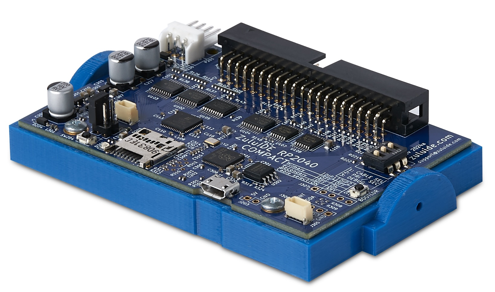

ZuluIDE™ is a hardware interface between IDE bus and SD cards. Currently it supports emulating ATAPI CD-ROM drives, Zip Drive 100, and a generic removable drive by providing access to image files stored on SD card. ISOs and bin/cue files are stored on a standard FAT32 or exFAT-formatted SD card. SDXC cards of up to 512GB are supported.

## Features

* Emulates IDE/ATAPI CD-ROM drives of any size.
* Emulates ZIP100 ATAPI removable media.
* [Open-source firmware](https://github.com/rabbitholecomputing/zuluIDE-firmware), licensed under the GPLv3

#### Firmware origins

The ZuluIDE™ firmware is derived from two sources, both under GPL 3 license:

* [SCSI2SD V6](https://github.com/rabbitholecomputing/SCSI2SD-V6-firmware-archive)
* [ZuluSCSI](https://github.com/zuluscsi/ZuluSCSI-firmware)
