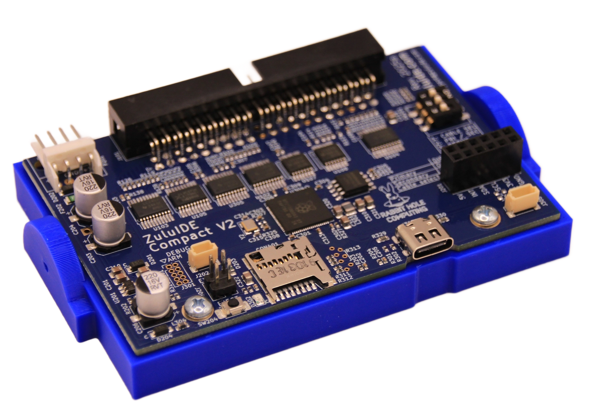

ZuluIDE™ is a hardware interface between IDE bus and SD cards. Currently it supports emulating ATAPI CD-ROM drives, Zip Drive 100, and a generic removable drive by providing access to image files stored on SD card. ISOs and bin/cue files are stored on a standard FAT32 or exFAT-formatted SD card. SDXC cards of up to 512GB are supported.

## ZuluIDE Features

* [Firmware-updateable](https://github.com/ZuluIDE/ZuluIDE-firmware/releases) - as simple as copying a file to your SD card
* Emulates IDE/ATAPI CD-ROM drives of any size
* Emulates ZIP100 ATAPI removable media
* Emulates rigid ATA/IDE hard drives, with support for both raw (.bin/.hda/.hdf) and Virtual Hard Drive VHD (Version 1) image files
* [Open-source firmware](https://github.com/rabbitholecomputing/zuluIDE-firmware), licensed under the GPLv3
* Supported transfer modes:
  * [PIO modes](https://en.wikipedia.org/wiki/Programmed_input%E2%80%93output) 0-3
  * [Ultra DMA](https://en.wikipedia.org/wiki/UDMA) 0-1
  * **ATA/33** (new with ZuluIDE V2) at up to 28 megabytes per second 
