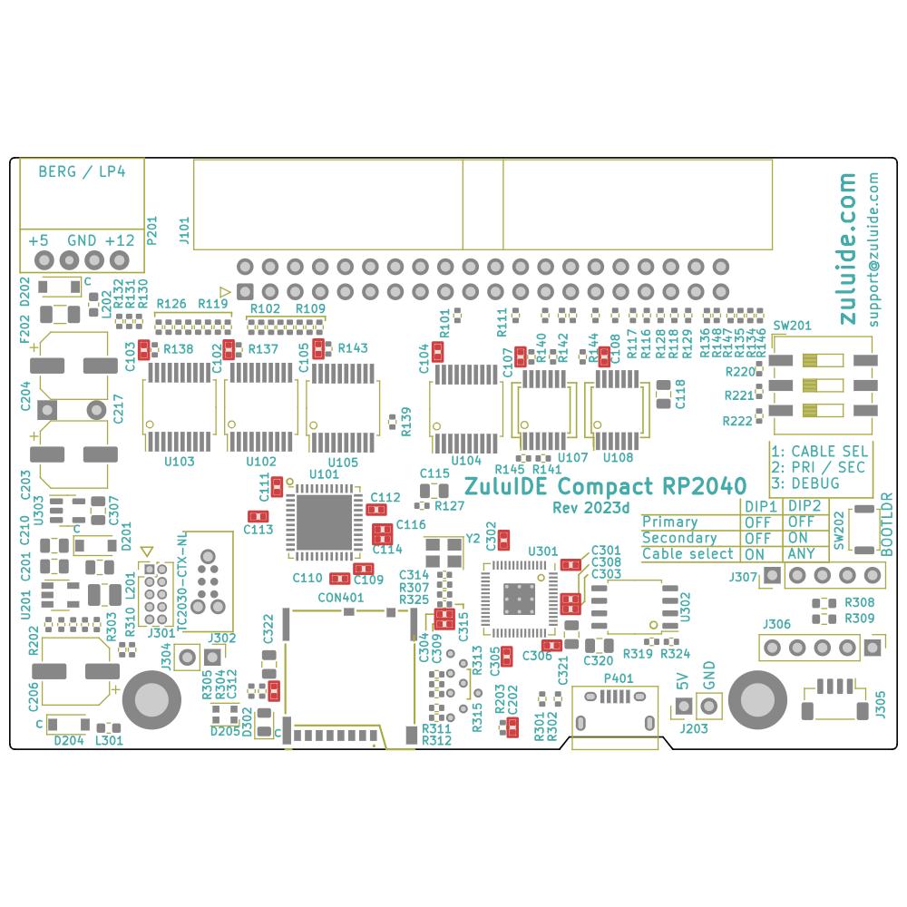




ZuluIDE™ is a IDE computer storage emulation platform, where CD-ROM drive images are stored on a standard FAT32 or exFAT-formatted SD card.

## Features

* [Open-source firmware](https://github.com/zuluIDE/zuluIDE-firmware), licensed under the GPLv3

#### Firmware origins

The ZuluIDE™ firmware is derived from two sources, both under GPL 3 license:

* [SCSI2SD V6](http://www.codesrc.com/gitweb/index.cgi?p=SCSI2SD-V6.git;a=summary)
* [ZuluIDE](https://github.com/zuluscsi/ZuluSCSI-firmware)
